# `main_nb.ipynb` File Tree

This tree follows the files referenced by `notebooks/main_nb.ipynb` and the local Julia modules loaded by its `include` chain. External Julia packages are shown as dependencies rather than workspace files. Paths are relative to the repository root unless noted otherwise.

```mermaid
flowchart TD
    notebook["notebooks/main_nb.ipynb"]
    env["notebooks/bb_code/Project.toml + Manifest.toml"]
    entry["notebooks/bb_code/src/bb.jl"]

    notebook -->|Pkg.activate| env
    notebook -->|include| entry

    subgraph source["Included source modules"]
        cosmo["src/cosmo.jl"]
        background["src/background.jl"]
        matter["src/projected_matter.jl"]
        cheb["src/chebcoefs.jl"]
        integrals["src/integrals.jl"]
        funcs["src/funcs.jl"]
        plots["src/plots.jl"]
        gg["src/gg.jl"]
        paths["src/paths.jl"]
        config["src/config.jl"]
        plotconfig["src/plot_config.jl"]
    end

    entry --> cosmo
    entry --> background
    entry --> matter
    entry --> cheb
    entry --> integrals
    entry --> funcs
    entry --> plots
    entry --> gg
    entry --> paths
    entry --> config
    entry --> plotconfig

    subgraph data["Packaged input data read by config.jl"]
        z["data/background/z.npy"]
        chi["data/background/chi.npy"]
        bins["data/dNdzs_fullwidth.npz"]
    end

    config --> z
    config --> chi
    config --> bins

    subgraph optional["Optional reuse input referenced by main_nb.ipynb"]
        reuse["out/runs/no_sorting_run_2026_07_20_102547/quantities/W_tilde.npy"]
    end

    notebook -.->|reuse = true| reuse

    subgraph generated["Generated run artifacts"]
        run["out/runs/run_<timestamp>/"]
        runinfo["output_info.txt"]
        wt["quantities/W_tilde.npy"]
        sl["quantities/Sl/S_lkk_gg.npy"]
        plotsout["plots/**/*.png and *.gif"]
    end

    notebook -->|creates| run
    run --> runinfo
    run --> wt
    run --> sl
    run --> plotsout

    subgraph packages["External Julia package dependencies"]
        packages_list["Pkg environment packages: NPZ, HDF5, Plots, QuadGK, FFTW, FastTransforms, FastChebInterp, Tullio, Cosmology, DifferentialEquations, DataInterpolations, CSV, DataFrames, JSON, and others"]
    end

    env --> packages_list
    entry --> packages_list

    paper["arXiv:1807.10331\nGalaxy bias reference"]
    notebook -.->|cited in markdown| paper

    classDef direct fill:#e8f1ff,stroke:#2864b0,stroke-width:1px
    classDef generated fill:#fff1d6,stroke:#b26a00,stroke-width:1px
    classDef external fill:#e8f7ed,stroke:#2f855a,stroke-width:1px
    classDef citation fill:#f4e8ff,stroke:#7b3fb5,stroke-width:1px

    class notebook,env,entry,cosmo,background,matter,cheb,integrals,funcs,plots,gg,paths,config,plotconfig,z,chi,bins direct
    class run,runinfo,wt,sl,plotsout,reuse generated
    class packages_list external
    class paper citation
```

## Notes

- `bb.jl` is the entry point included by the notebook; its `include` statements load the 11 source modules shown above.
- `config.jl` reads the three packaged input files used to build the cosmology and redshift grids.
- The `W_tilde.npy` reuse path is hard-coded as an absolute path in the notebook and is only read when `reuse = true`.
- The run directory is timestamped, so its exact name is created at execution time. Plot files are produced by the plotting functions and may vary with the executed cells.
- `notebooks/bb_code/src/blast_tutorials.jl`, `Blast.jl`, and `shear_shear.jl` exist in the source directory but are not included by `bb.jl` for this notebook.
